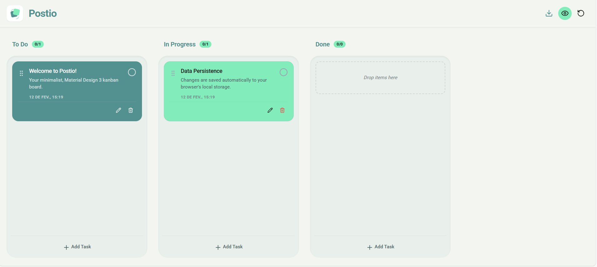

<div align="center">
  
# 📋 Postio

### Quadro Kanban Interativo para Gerenciamento de Tarefas

[](https://reactjs.org/)
[](https://www.typescriptlang.org/)
[](https://vitejs.dev/)
[](LICENSE)



</div>

---

## ✨ Sobre o Projeto

**Postio** é um aplicativo web moderno de gerenciamento de tarefas no estilo Kanban. Organize suas atividades de forma visual e intuitiva com uma interface limpa e funcional de arrastar e soltar.

### 🎯 Funcionalidades Principais

- **📊 Quadro Kanban Completo**: Organize tarefas em múltiplas colunas (A Fazer, Em Progresso, Concluído, Arquivado)
- **🖱️ Drag & Drop Fluido**: Arraste e solte tarefas entre colunas com animações suaves
- **🎨 Customização de Cores**: 5 opções de cores temáticas para categorizar suas tarefas
- **✏️ CRUD Completo**: Interface modal intuitiva para adicionar, editar e excluir tarefas
- **👁️ Modo de Visualização**: Alterne entre modo editável e somente leitura
- **💾 Persistência Automática**: Todas as alterações são salvas automaticamente no localStorage
- **📥 Exportação de Dados**: Exporte todas as suas tarefas em formato JSON
- **🔄 Reset de Dados**: Restaure os dados iniciais quando necessário
- **📱 Design Responsivo**: Interface totalmente adaptável para desktop e dispositivos móveis
- **⌨️ Suporte a Teclado**: Navegue e organize tarefas usando apenas o teclado

---

## 🛠️ Tecnologias Utilizadas

Este projeto foi construído com as seguintes tecnologias:

- **[React 19](https://reactjs.org/)** - Biblioteca JavaScript para construção de interfaces
- **[TypeScript](https://www.typescriptlang.org/)** - Superset JavaScript com tipagem estática
- **[Vite](https://vitejs.dev/)** - Build tool moderna e rápida
- **[@dnd-kit](https://dndkit.com/)** - Biblioteca moderna de drag-and-drop
  - `@dnd-kit/core` - Core do drag-and-drop
  - `@dnd-kit/sortable` - Funcionalidades de ordenação
  - `@dnd-kit/utilities` - Utilitários auxiliares
- **[Lucide React](https://lucide.dev/)** - Ícones modernos e elegantes

---

## 🚀 Como Executar

### Pré-requisitos

- **Node.js** (versão 16 ou superior)
- **npm** ou **yarn**

### Instalação

```bash
# Clone o repositório
git clone https://github.com/OYanEnrique/postio.git

# Entre no diretório do projeto
cd postio

# Instale as dependências
npm install
```

### Executando em Desenvolvimento

```bash
# Inicie o servidor de desenvolvimento
npm run dev
```

O aplicativo estará disponível em `http://localhost:5173`

### Build para Produção

```bash
# Crie o build otimizado
npm run build

# Visualize o build de produção localmente
npm run preview
```

---

## 📁 Estrutura do Projeto

```
postio/
├── components/              # Componentes React reutilizáveis
│   ├── Button.tsx          # Botão personalizado
│   ├── Column.tsx          # Coluna do Kanban (droppable)
│   ├── IconButton.tsx      # Botão com ícone
│   ├── TaskCard.tsx        # Card de tarefa (draggable)
│   └── TaskModal.tsx       # Modal de criação/edição
├── screenshot/             # Capturas de tela
├── App.tsx                 # Componente principal da aplicação
├── types.ts                # Definições de tipos TypeScript
├── data.ts                 # Dados iniciais e configurações
├── index.tsx               # Entry point da aplicação
├── index.html              # Template HTML
├── vite.config.ts          # Configuração do Vite
├── tsconfig.json           # Configuração do TypeScript
└── package.json            # Dependências e scripts
```

---

## 🎨 Paleta de Cores

O Postio utiliza uma paleta de cores harmoniosa e profissional:

| Cor | Hex | Uso |
|-----|-----|-----|
| **Deep Teal** | `#539190` | Cor primária, elementos de destaque |
| **Mint Green** | `#83ecbb` | Cor secundária, containers |
| **Soft Surface** | `#f3f5f0` | Fundo da aplicação |
| **White** | `#ffffff` | Cards e elementos de conteúdo |
| **Soft Teal** | `#d0e0e0` | Variação suave do primário |

---

## 💡 Como Usar

1. **Adicionar Tarefa**: Clique no botão "+" em qualquer coluna
2. **Editar Tarefa**: Clique em uma tarefa existente
3. **Mover Tarefa**: Arraste e solte entre as colunas
4. **Deletar Tarefa**: Clique no ícone de lixeira no card
5. **Alternar Modo**: Use o ícone de olho para modo visualização
6. **Exportar Dados**: Clique no ícone de download
7. **Resetar Dados**: Clique no ícone de reset

---

## 📝 Scripts Disponíveis

| Script | Descrição |
|--------|-----------|
| `npm run dev` | Inicia o servidor de desenvolvimento |
| `npm run build` | Cria o build de produção |
| `npm run preview` | Visualiza o build de produção |

---

## 🤝 Contribuindo

Contribuições são sempre bem-vindas! Sinta-se à vontade para:

1. Fazer um fork do projeto
2. Criar uma branch para sua feature (`git checkout -b feature/AmazingFeature`)
3. Commit suas mudanças (`git commit -m 'feat: add some amazing feature'`)
4. Push para a branch (`git push origin feature/AmazingFeature`)
5. Abrir um Pull Request

---

## 📄 Licença

Este projeto está sob a licença MIT. Veja o arquivo [LICENSE](LICENSE) para mais detalhes.

---

## 👤 Autor

**OYanEnrique**

- GitHub: [@OYanEnrique](https://github.com/OYanEnrique)

---

## ⭐ Mostre seu Apoio

Se este projeto foi útil para você, considere dar uma ⭐️!

---

<div align="center">
  Feito com ❤️ e TypeScript
</div>